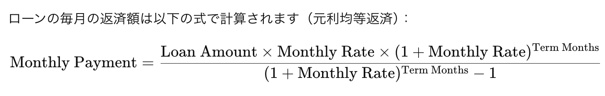

# Debt Default Risk Reduction - Predicting Loan Repayment Status

**【練習問題】債務不履行リスクの低減**  
借入総額や返済期間、金利、借入目的などの顧客データを使って、債務不履行リスクを予測するモデルを構築しました。

---

## プロジェクト概要 (Introduction)

### **概要**
本プロジェクトは「**債務不履行リスクの低減**」を目的とし、与えられた顧客データを用いて、**債務が完済されるかどうか**を予測します。

- **評価指標**: F1スコア  
- **現在の成績**: 523人中 **39位(上位10%以内）**  

### **使用データ**
- **説明変数**:  
   - `loan_amnt`: 借入総額  
   - `term`: 返済期間  
   - `interest_rate`: 金利  
   - `purpose`: 借入目的  
   - その他、計9特徴量  
- **目的変数**:  
   - `0`: Fully Paid（完済）  
   - `1`: Charged Off（債務不履行）  

### **データ概要とEDAのインサイト**
- **データの特徴**
   - サンプル数: 242,156  
   - 欠損値: employment_length に欠損値 
   - データ分布:   
   - 目的変数の分布:
   - - 完済: 80% 
   - - 債務不履行: 20%

### **主なEDA結果とインサイト**
1. Burden Index（負担指数）と Monthly Payment（月々の支払額）の関係：

Burden Index が高いほど、債務不履行の割合 が増える傾向が見られます。
返済期間（36ヶ月 と 60ヶ月）が月々の支払額に影響し、2つのクラスターに分かれます。

2. Loan Amount（借入額）と Monthly Payment（支払額）の傾向：

完済（青） と 不履行（赤） の比較において、
月々の支払額が多い場合、不履行のリスクが高まる傾向があります。

3. Credit Score、Loan Status、Interest Rate（利率）の 傾向:

グレイドとクレジットスコアが高いほど、金利（interest_rate）も高くなり、債務不履行の可能性が増加します。
また、目的別で債務不履行の傾向を確認すると住宅リフォームの目的で借入する場合は、債務不履行になる可能性が低いです。

### 前処理**
#### 1. employment_length の前処理
employment_length 列は、借り手の勤務年数を表す特徴量です。この列は文字列型なので、数値型の特徴量として利用するには以下のような変換が必要でした：

"10 years" や "2 years" の文字列部分（years や year）を削除し、純粋な数値に変換。
"< 1 year" を特別に扱い、0 に変換。
NaN（欠損値）はそのまま保持して、後続の処理やモデルで適切に扱えるようにする。
これを実現するために処理関数 process_employment_length を定義しました：

正規表現の使用理由:
'years' や 'year' を削除する処理を一貫して簡潔に記述するために使用しました。
'< 1' を特別に置き換える処理も正規表現を用いて効率化しています。

#### 2. term の前処理
term 列は、ローンの返済期間（例："36 years"）を表しています。この列も文字列型で提供されており、数値型に変換する必要がありました。

そこで、以下のような処理を行いました：

"years" の部分を削除。
結果を数値型（float）に変換。
もし値が欠損値（NaN）であれば、そのまま保持。
これを実現するために、apply 関数と正規表現を使用しました：

正規表現の使用理由:
"years" を一括して削除し、前後の空白を除去するため。
欠損値をそのまま扱うための isinstance(x, str) チェックを追加。

### なぜこの処理が必要か
機械学習モデルは数値型データを扱う:

employment_length や term のような文字列データは、そのままではモデルに入力できないため、数値型に変換しました。

欠損値（NaN）の保持:

欠損値を削除せずに保持することで、モデルがその特徴を考慮できるようにしました。LightGBM のようなツリーベースのモデルは NaN を直接扱えるため、この選択を採用しました。
データの一貫性と精度の向上:

文字列データを統一したフォーマットで数値型に変換することで、分析やモデルのトレーニング時にエラーが発生しないようにしました。

#### 3. interest_rate の正規化
interest_rate 列は、ローンの利率を示す特徴量で、パーセント形式で提供されています（例: 5.5, 12.75）。しかし、モデルでは小数形式（0.055, 0.1275）の数値型として扱う方が適切です。

理由:

パーセント表記は人間にとって分かりやすいものですが、数値として扱う際には小数形式にすることで直接的な計算が可能になります。
正規化により、モデルのスケーリングや学習効率を改善します。

#### 4. grade のラベルエンコーディング
grade 列は、借り手の信用格付けを示すカテゴリカルデータです（例: A, B, C）。機械学習モデルで直接扱うには、数値に変換する必要があります。そのため、ラベルエンコーディングを適用しました。

理由:

数値に変換することで、モデルがこの特徴量を直接扱えるようになります。
ラベルエンコーディングを使用する場合、カテゴリ間に順序がある（例えば、A > B > C のような信用格付けの優劣）ことを前提としています。

#### 5. 月利と返済回数の計算
interest_rate（年利）と term（ローン期間）が与えられているため、月利と返済回数を計算しました。
ローンの毎月の返済額は以下の式で計算されます（元利均等返済）：

ポイント:

月利が0の場合: 元金を返済期間で均等に割る単純な計算に切り替えています。
この柔軟な実装により、データ内で特殊な状況にも対応可能です。

#### ​5. 負担指数（burden_index）の計算
burden_index（返済負担指数）は、借り手の返済負担を評価するために'total_payment'を'credit_score'で割って計算しました。

計算意図:

借り手の credit_score（信用スコア）に対して、総返済額を比較することで、返済の負担感を定量化します。
負担指数が高いほど、借り手にとって返済が負担となる可能性が高いと推測できます。

 
### **使用したモデルと手法**
1. モデル構築
LightGBM

F1スコア: 0.4153864

CatBoost

F1スコア: 0.4138822

2. パラメータチューニング
Optuna を使用して、最適なパラメータを探索。

3. クロスバリデーション
Stratified K-Fold（5分割）を適用し、モデルの汎化性能を確認。
 
### **結果の可視化**
- **重要な可視化結果**:
Burden Index と Monthly Payment:
Loan Amount と Monthly Payment:

- **目的変数の分布**:

### **今後の課題と改善点**
- **モデルの精度向上**:

CatBoostの結果を確認し、LightGBMとのアンサンブルを検討しましたが、思うような改善は見られませんでした。

- **特徴量エンジニアリング**:

勤務年数とローン年数を合計し、新しい特徴量を作成しました。

- **モデル解釈**:
Permutation Importanceを用いて、特徴量の重要度を可視化。

### **環境構築**
Python: 3.8

pip install pandas numpy matplotlib seaborn lightgbm catboost optuna scikit-learn

### **まとめ**
本プロジェクトでは、顧客の債務不履行リスクを予測するためにEDAとLightGBM、CatBoostを活用しました。
現在のF1スコアは 0.4153864です。 CatBoostの結果を踏まえ、さらなる精度改善を目指します。
