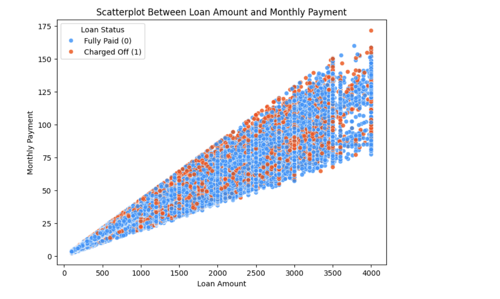

# **【練習問題】Debt Default Risk Reduction - Predicting Loan Repayment Status**

## **プロジェクト概要 (Project Overview)**
このプロジェクトでは、顧客データ（借入総額、返済期間、金利、借入目的など）を活用して、債務不履行リスクを予測するモデルを構築しました。目的は、リスクの高い顧客を特定し、債務不履行を未然に防ぐ方法を見出すことです。

### **プロジェクトの目的**
「債務不履行リスクの低減」を目的とし、以下を実現する予測モデルを開発しました。
- 顧客のローン返済状況（完済または債務不履行）の予測
- 予測結果に基づいた、リスク管理およびビジネス改善の提案

### **評価指標**
- **F1スコア**  
  現在のスコア: **0.415**
- コンペティション順位: **523人中39位**（上位10%）

### **使用データ**
- **説明変数（特徴量）**  
  - `loan_amnt`: 借入総額  
  - `term`: 返済期間  
  - `interest_rate`: 金利  
  - `purpose`: 借入目的  
  - その他、計9特徴量

- **目的変数**  
  - `0`: Fully Paid（完済）  
  - `1`: Charged Off（債務不履行）

## **データ概要とEDAのインサイト (Data Overview and EDA Insights)**

### **データの特徴**
- **サンプル数**: 242,156
- **欠損値**: `employment_length` に欠損値あり
- **目的変数の分布**:
  - **完済 (Fully Paid)**: 80%
  - **債務不履行 (Charged Off)**: 20%

### **目的変数の分布**


債務不履行（`1`）は全データの約20%を占めています。このため、モデル構築時にはクラスの不均衡を考慮する必要があります。

## **主なEDA結果とインサイト (Key EDA Results and Insights)**

### **1. Interest Rate（金利）と Credit Score（クレジットスコア）の関係**


- **クレジットスコアが低いほど金利が高い**
  - 金融業界の一般的なルールを反映しています。リスクの高い借り手（クレジットスコアが低い）は、より高い金利を課される傾向にあることが確認できます。

- **クレジットスコアが800以上の場合、金利の変動が少ない**
  - クレジットスコアが800を超える場合、金利の中央値がほぼ一定で、レンジも狭くなっています。このことから、信用度の高い借り手が優遇される傾向が見られます。

- **金利のばらつきが大きいスコア帯**
  - 特にクレジットスコアが660～700の範囲では、金利のばらつきが広いことが確認できます。これは、このスコア帯に属する借り手が多様な信用リスクプロファイルを持っているためと推測されます。

- **異常値の観察**
  - ボックスプロット上部の外れ値（特にスコアが高い場合でも金利が異常に高いもの）に注目することで、新たなインサイトを得られる可能性があります。例: 特殊な借入条件や目的が影響している可能性。

---

### **追加の考察**
1. **政策変更や金融商品への影響**
   - クレジットスコアと金利の関係を基に、スコアの境界値（例: 700や800）をターゲットにした特別な融資プランを作成することで、債務不履行リスクを抑える施策が提案できます。

2. **リスク予測モデルへの活用**
   - クレジットスコアと金利の相関をモデルの重要な特徴量として活用することで、より精度の高い債務不履行リスクの予測が可能になります。

---

### **2. Total Payment と Loan Status の関係**


#### **インサイト**
1. **Total Payment が低い場合のリスク**
   - **$1,000以下**の総支払額の場合、債務不履行の割合は非常に低い。
   - 小額借入者は返済能力に問題がない傾向が見られる。

2. **$5,000以上の高額借入のリスク増加**
   - 総支払額が**$5,000以上**になると、債務不履行の割合が急激に増加。
   - 高額借入者にはリスクが高まり、追加の審査や保証条件が必要と考えられる。

3. **債務不履行者の分布**
   - 債務不履行者は広範囲の借入額で確認されるが、特に**$5,000以上**の高額借入で集中している。
   - この傾向から、貸付額の上限を再検討する必要がある可能性が示唆される。

---

#### **提案**
1. **小額ローンの審査基準を簡略化**
   - **$1,000以下**の借入額に対して、審査基準を簡略化することで、顧客体験を向上させ、取引量の増加を目指す。

2. **高額借入者向けの追加保証**
   - **$5,000以上**の借入額に対して、以下を追加検討:
     - 担保の提供
     - 収入証明書の提出

3. **貸付額の上限を調整**
   - 高額借入のリスクを軽減するため、最大貸付額を調整し、健全な貸付ポートフォリオを維持する。

---

### **3. Monthly Payment と Loan Status の関係**


#### **インサイト**
1. **低額月々支払い（$25以下）の債務不履行リスク**
   - 月々の支払額が**$25以下**の場合、債務不履行の割合が非常に低い。
   - 低額借入者はリスクが少なく、返済能力が比較的高いと推測される。

2. **中額月々支払い（$25〜$100）の債務不履行の割合**
   - 支払額が**$25〜$100**の範囲では、債務不履行の割合が徐々に増加している。
   - この範囲では、顧客の支払い能力が徐々に限界に近づいている可能性がある。

3. **高額月々支払い（$100以上）のリスク急増**
   - 月々の支払額が**$100を超える**と、債務不履行の割合が急激に増加。
   - 高額返済者の約**50%**が不履行のリスクを抱えている。

4. **右尾の分布（$150以上）**
   - ごく少数のケースだが、極端に高額な月々支払額を持つ借入者はさらに高いリスクを示す。
   - 特別な支援策が必要とされる。

---

#### **提案**
1. **低額ローンの審査基準を緩和**
   - **$25以下**のローンに対して審査基準を緩和することで、リスクの少ない新規顧客の獲得を促進。

2. **教育的アプローチ**
   - **$25〜$100**の範囲の顧客に対して、返済計画の相談やアドバイスを提供。
   - データ駆動型の早期警告システムを導入し、債務不履行を予防。

3. **高額ローンへの追加審査**
   - **$100以上**の支払額を持つ借入者に対して、以下の追加審査を検討:
     - 収入証明書の提出
     - 担保提供の義務化

4. **柔軟な返済プランの提供**
   - 極端に高額な月々支払額を持つ顧客に対して、以下を提案:
     - 返済期間の延長
     - 分割支払額の減額

---

#### **ステークホルダーへの提案**
1. **審査基準の再設計**
   - 支払額が**$100以上**となる借入者に対し、リスク評価を強化。
   - 例: 顧客の信用スコアや収入データを基にしたリスクモデルの導入。

2. **リスク緩和策**
   - 高額ローンの顧客には、柔軟な返済プランを提供して債務不履行を防止。

3. **低リスク層の拡大**
   - **$25以下**の顧客基盤を拡大することで、ポートフォリオ全体のリスクを分散。

---

### **4. Credit Score と Loan Status の関係**


#### **インサイト**
1. **リスク管理の優先対象**
   - **クレジットスコア750以下**の層では、債務不履行の可能性が高まる傾向が見られます。
   - 特にスコアが**650〜700**の層はリスクが顕著であり、重点的なモニタリングが必要です。

2. **低リスク層の活用**
   - **クレジットスコア750以上**の借り手は、債務不履行の割合が非常に低い低リスク層です。
   - この層への貸付を増やすことで、全体のポートフォリオリスクを低減可能。

3. **スコア分布を利用した新商品開発**
   - スコア分布に基づき、異なる条件を設定したローン商品（例: リスクに応じた金利や返済期間）を提供することで、ターゲット層を拡大可能。

---

#### **提案**
1. **リスクアセスメント強化**
   - **スコア650〜700**の層に対して、事前のリスクアセスメントを強化。
   - 審査プロセスを厳密化し、債務不履行リスクを軽減。

2. **高スコア層への優遇**
   - **スコア750以上**の高スコア層には、優遇金利や特別条件を提供することで、優良顧客の獲得を促進。

3. **スコア分布を考慮した商品戦略**
   - **750以下の借り手**:
     - 厳しい審査基準や保証条件を設定。
   - **750以上の借り手**:
     - リスクの低さを活用したローンキャンペーンを展開。
   - スコア分布を活用し、顧客のリスクプロファイルごとに差別化した商品を開発。

---

### **5. Burden Index（負担指数）と Loan Status の関係**


#### **インサイト**
1. **負担指数が2を超えると債務不履行が急増**
   - 負担指数が**2を超える**と、完済（loan_status=0）の割合が急激に減少し、債務不履行（loan_status=1）の割合が増加。
   - **解釈:** 借り手の返済負担が過剰になると、返済能力が追いつかず、債務不履行リスクが高まる。

2. **負担指数が2未満の借り手は低リスク**
   - 負担指数が**2未満**では、債務不履行の割合が非常に低く、安定した返済能力を持つことを示す。
   - **解釈:** この層は低リスクであり、金融機関にとって安心して融資可能な顧客群。

3. **負担指数が6以上の層は極端なリスク**
   - 負担指数が**6以上**では、債務不履行がほぼ確実に発生し、極めて高いリスク層とみなされる。
   - **解釈:** この層に融資を行う場合、極めて厳しい審査基準が必要。

---

#### **提案**
1. **審査基準の見直し**
   - 負担指数が**2を超える層**に対して、以下を導入:
     - 収入証明書や資産証明の提出を必須化。
     - 返済能力を正確に評価する追加基準を設定。

2. **柔軟な返済プランの提供**
   - 高負担指数（**2以上**）の借り手に対し:
     - 分割返済や返済期間延長を含む柔軟な返済プランを提供。
   - **目的:** 返済負担を軽減し、債務不履行リスクを低減。

3. **低リスク層へのプロモーション**
   - 負担指数が**2未満**の借り手に対し:
     - 優遇金利や特別なローン条件を提供。
   - **目的:** 優良顧客層を拡大し、ポートフォリオ全体のリスクを抑制。

4. **高リスク層への対応**
   - 負担指数が**6以上**の層には:
     - 融資条件を厳格化。
     - 必要に応じて融資を制限。

5. **教育と支援プログラム**
   - 高負担指数（**2以上**）の借り手に対し:
     - 返済計画や家計管理に関する教育プログラムを提供。
   - **目的:** 借り手が返済負担を正しく認識し、適切に対応できるよう支援。

---

### **6. Loan Amount と Monthly Payment の関係**


#### **インサイト**
1. **借入額と月々の支払額の正の相関**
   - 借入額が増加するほど、月々の支払額も増加する傾向。
   - **解釈:** 借入額と月々の支払額は強い正の相関を持ち、ローン契約の基本的なルールを反映。

2. **債務不履行がローン期間によって分かれる傾向**
   - プロット内で赤い点（債務不履行）が、ローン期間（**36ヶ月**と**60ヶ月**）に応じて2つの明確なラインを形成している。
   - 例えば、借入額が**$2000**の場合、月々の返済額が**$50**（60ヶ月）ではほぼ完済される一方、**$75付近**になると債務不履行が発生。
   - また、借入額が**$3000**の場合、月々の支払額が**$75**（60ヶ月返済）で債務不履行が多い。一方、**$125（36ヶ月返済）**では、60ヶ月返済と比較して債務不履行が少ない。

3. **ローン期間と金額に依存する債務不履行の傾向**
   - 債務不履行は、**借入金額**と**ローン期間**の相互作用に依存している可能性が高い。
   - 長期間（60ヶ月）のローンでは、月々の支払額が少なくなるものの、高額の借入はリスクが増加。
   - 短期間（36ヶ月）のローンでは、支払額が高くなるが、比較的リスクが抑えられる傾向が見られる。

---

#### **考察と追加の要因**
1. **借り手の収入や信用スコアの影響**
   - 借入期間や金額の選択は、借り手の**収入**や**信用スコア**などの要因にも影響を受ける可能性。
   - 高収入の借り手は、短期間のローン（36ヶ月）でも対応できるため、債務不履行が少ない傾向。

2. **金利の影響**
   - 高額借入や長期間ローンでは、金利負担が増加し、最終的な返済額が大きくなるため、これも債務不履行に影響を与えている可能性。

3. **返済計画の柔軟性**
   - 借り手が柔軟な返済計画を利用できる場合、債務不履行を防ぐことができる可能性がある。

---

#### **提案**
1. **ローン期間と金額に応じたリスク評価**
   - 借入額**$3000以上**でローン期間が**60ヶ月**の場合、債務不履行のリスクが高いため、追加審査を導入。
   - 返済期間を選択する際に、借り手の負担指数（Burden Index）や収入を考慮した評価基準を適用。

2. **リスクに応じた金利設定**
   - 短期間（36ヶ月）のローンには、低リスク層向けに優遇金利を設定し、返済意欲を高める。
   - 長期間（60ヶ月）のローンでは、リスクに応じた金利調整を検討。

3. **借り手教育とサポート**
   - 高額ローンを希望する借り手には、返済期間に応じた総支払額やリスクを明示し、適切な選択を促進。

4. **柔軟な返済プラン**
   - 高リスク層には、分割支払いの柔軟性や金利の一部免除など、負担を軽減する施策を導入。

---

### **7. Burden Index と Monthly Payment の関係**


#### **インサイト**
1. **返済期間による明確なクラスター**
   - 図中に見られる2つの明確なラインは、返済期間**36ヶ月**と**60ヶ月**に対応しています。
   - **解釈:**
     - 同じ負担指数（Burden Index）でも、返済期間が長い場合（**60ヶ月**）は月々の支払額が低く抑えられます。
     - 返済期間が短い場合（**36ヶ月**）は月々の支払額が高くなります。

2. **債務不履行の集中領域**
   - どちらの返済期間でも、負担指数が高い領域（**Burden Index > 4**）で**債務不履行**（Charged Off, 赤い点）の割合が増加。
   - 特に、返済期間が**36ヶ月**で月々の支払額が高い層に、不履行が集中しています。
   - **解釈:**
     - 短期間の高額返済は、借り手にとって大きな負担となり、不履行リスクを高める要因。

3. **完済層の安定性**
   - 負担指数が低い（**Burden Index < 2**）層では、ほとんどが**完済**（Fully Paid, 青い点）。
   - **解釈:**
     - 負担が適度に抑えられている場合、借り手は計画的に返済を進められる。

---

#### **考察**
1. **借入期間と負担指数の相互作用**
   - 短期間のローン（36ヶ月）は、月々の返済負担が増大しやすく、高額ローンでは特にリスクが高い。
   - 長期間のローン（60ヶ月）は、負担を分散する効果があるが、全体の利息負担が増加する可能性。

2. **高負担指数層のリスク管理**
   - **Burden Index > 4** の層では、不履行リスクが著しく高い。
   - この層をターゲットにしたリスク軽減策が必要。

---

#### **提案**
1. **返済期間の柔軟性の提供**
   - 高額ローンや高い負担指数の借り手には、返済期間を**60ヶ月以上**に延長するオプションを提供。
   - **目的:** 月々の支払額を軽減し、不履行リスクを低減。

2. **負担指数に基づく審査強化**
   - **Burden Index > 4** の層には、より厳格な審査基準を設定。
   - **例:** 借入時の収入証明書や信用スコアの詳細確認を必須化。

3. **リスクの高い短期ローンへの注意**
   - 返済期間が**36ヶ月**で負担指数が高い借り手には、以下の対策を提案：
     - 返済能力に応じた分割プランの提案。
     - ローン金額の調整を推奨。

4. **リスクの低い借り手層へのプロモーション**
   - 負担指数が低い層（**Burden Index < 2**）に対し、**優遇金利**や特別プランを提供。
   - **目的:** 安定した収益源を拡大し、低リスク層を取り込む。

5. **教育プログラムの提供**
   - 高負担指数の借り手に対して：
     - **返済計画**や**家計管理**についての教育プログラムを提供。
     - **目的:** 借り手が返済負担を正しく認識し、適切な対応ができるよう支援。

---

#### **まとめ**
- 負担指数と返済期間の関係を基に、借り手に適切な返済プランを提供することが、債務不履行リスクの低減につながる。
- リスクの高い層には厳格な審査を、リスクの低い層には優遇条件を設定することで、全体のポートフォリオを健全化できる。

---

### **前処理**

#### **1. `employment_length` の前処理**
`employment_length` 列は、借り手の勤務年数を表す特徴量です。この列は文字列型で提供されており、モデルに活用するためには数値型への変換が必要でした。以下の処理を実施しました：

1. **文字列部分の削除**
   - `"10 years"` や `"2 years"` といった文字列から、`"years"` や `"year"` を削除し、純粋な数値を抽出。
   - 例:
     - `"10 years"` → `10`
     - `"2 years"` → `2`

2. **特殊ケースへの対応**
   - `"< 1 year"` を特別に扱い、`0` に変換。
   - 例:
     - `"< 1 year"` → `0`

3. **欠損値（NaN）の保持**
   - 欠損値はそのまま保持し、モデルが欠損情報を考慮できるように設計。
   - 欠損値を削除せず、後続の処理で適切に扱えるようにしました。

---

#### **Pythonコード**
以下のコードで上記の処理を実装しました：

```python
import re

def process_employment_length(value):
    if isinstance(value, str):
        # "< 1 year" を 0 に変換
        if "< 1" in value:
            return 0
        # "years" または "year" を削除し、数値を抽出
        else:
            return int(re.sub(r'[^0-9]', '', value))
    # NaN の場合、そのまま保持
    return value

# データフレームに適用
df['employment_length'] = df['employment_length'].apply(process_employment_length)

```
---

#### **2. `term` の前処理**
`term` 列は、ローンの返済期間を表す特徴量であり、文字列型（例: `"36 months"`）で提供されています。この列を数値型に変換するため、以下の処理を行いました。

---

### **前処理の手順**
1. **不要な文字列の削除**
   - `"months"` の部分を削除し、数値部分のみを抽出。
   - 例:
     - `"36 months"` → `36`
     - `"60 months"` → `60`

2. **数値型（float）への変換**
   - 変換後のデータを数値型（float）として扱えるようにしました。

3. **欠損値（NaN）の保持**
   - 欠損値（NaN）が存在する場合はそのまま保持。
   - 欠損データもモデルが考慮できるように設計。

---

### **Pythonコード**
以下のコードで上記の処理を実装しました：

```python
import re

def process_term(value):
    if isinstance(value, str):
        # "months" を削除し、数値部分のみを抽出
        return int(re.sub(r'[^0-9]', '', value))
    # NaN の場合、そのまま保持
    return value

# データフレームに適用
df['term'] = df['term'].apply(process_term)

```
---

#### **3. `interest_rate` の正規化**
`interest_rate` 列は、ローンの利率を示す特徴量で、パーセント形式（例: `5.5`, `12.75`）で提供されています。この列をモデルに適した形式で活用するため、以下の正規化を行いました。

---

### **正規化の手順**
1. **パーセント形式から小数形式への変換**
   - パーセントを小数に変換するため、各値を100で割る。
   - 例:
     - `5.5` → `0.055`
     - `12.75` → `0.1275`

2. **欠損値（NaN）の保持**
   - 欠損値が存在する場合はそのまま保持。

---

### **Pythonコード**
以下のコードで上記の正規化を実装しました：

```python
def normalize_interest_rate(value):
    if value is not None:  # 欠損値のチェック
        return value / 100  # パーセントから小数へ変換
    return value  # 欠損値はそのまま保持

# データフレームに適用
df['interest_rate'] = df['interest_rate'].apply(normalize_interest_rate)

```
---

#### **4. `grade` のラベルエンコーディング**
`grade` 列は、借り手の信用格付けを示すカテゴリカルデータです（例: `A`, `B`, `C`）。機械学習モデルで直接扱うためには、この列を数値データに変換する必要があります。そこで、ラベルエンコーディングを適用しました。

---

### **ラベルエンコーディングの手順**
1. **カテゴリの順序を保持**
   - 信用格付けには順序関係がある（例: `A > B > C`）ため、この順序をそのまま反映させる数値変換を行いました。

2. **各カテゴリに数値を割り当て**
   - 例:
     - `A` → 1
     - `B` → 2
     - `C` → 3
     - ...

---

### **Pythonコード**
以下のコードでラベルエンコーディングを実装しました：

```python
# 信用格付けの順序に基づくマッピング
grade_mapping = {
    'A': 1,
    'B': 2,
    'C': 3,
    'D': 4,
    'E': 5,
    'F': 6,
    'G': 7
}

# データフレームにラベルエンコーディングを適用
df['grade'] = df['grade'].map(grade_mapping)

```
---

#### **5. 月利と返済回数の計算**
`interest_rate`（年利）と `term`（ローン期間）が与えられているため、月利と返済回数を計算しました。

ローンの毎月の返済額は以下の式で計算されます（元利均等返済）：

<p align="center">
  
</p>

---

### **ポイント**
1. **月利が0の場合**
   - 元金を返済期間で均等に割る単純な計算に切り替えています。
   - 例外的な状況でも正確に対応可能です。

2. **柔軟な実装**
   - データ内で特殊な状況や異常値（例: 金利がゼロ）の場合でも計算可能なロジックを適用しました。

---

### **Pythonコード**
以下のコードで毎月の返済額を計算しました：

```python
def calculate_monthly_payment(loan_amnt, annual_rate, term_months):
    # 月利を計算
    monthly_rate = annual_rate / 12 / 100
    if monthly_rate > 0:
        # 元利均等返済の計算
        return loan_amnt * (monthly_rate * (1 + monthly_rate)**term_months) / ((1 + monthly_rate)**term_months - 1)
    else:
        # 月利が0の場合
        return loan_amnt / term_months

# データフレームに適用
df['monthly_payment'] = df.apply(lambda row: calculate_monthly_payment(row['loan_amnt'], row['interest_rate'], row['term']), axis=1)

```
---

#### **6. 負担指数（burden_index）の計算**

`burden_index`（返済負担指数）は、借り手の返済負担を評価するために以下の式で計算されました：

### **計算式**
\[
\text{burden\_index} = \frac{\text{total\_payment}}{\text{credit\_score}}
\]

---

### **計算意図**
1. **返済負担の定量化**
   - 借り手の `credit_score`（信用スコア）に対して、`total_payment`（総返済額）を比較することで、借り手の負担感を数値化します。

2. **リスク評価**
   - 負担指数が高いほど、借り手にとって返済の負担が大きく、債務不履行のリスクが高いと推測できます。

3. **個別対応**
   - 負担指数を活用して、高負担の借り手を特定し、適切な返済プランを提供することでリスク軽減が可能です。

---

### **Pythonコード**
以下は負担指数を計算するコード例です：

```python
# 負担指数の計算
df['burden_index'] = df['total_payment'] / df['credit_score']

```
---

### 数値変数の相関関係

以下の相関行列は、数値型特徴量間の相関を視覚化したものです。


---

### 主な観察点
1. **高い相関を持つ特徴量**:
   - `loan_amnt`（借入額）と `total_payment`（総返済額）の相関係数は **0.97** と非常に高いです。
     - 解釈: 借入額が増加すると、総返済額も当然増加します。
   - `monthly_payment`（月々の支払額）と `burden_index`（負担指数）の相関係数は **0.96** と高いです。
     - 解釈: 月々の支払額が多い借り手は、相対的な返済負担も大きくなります。

2. **中程度の相関**:
   - `interest_rate`（金利）と `grade_group_average_total_payment` の相関係数は **0.89**。
     - 解釈: 金利が高いほど、借り手の信用格付けが低いことを示唆しています。

3. **低い相関**:
   - `credit_score`（信用スコア）と他の数値変数間の相関は比較的低い（例: `credit_score` と `loan_amnt` の相関係数は **0.08**）。
     - 解釈: 信用スコアは他の数値特徴量とは独立しており、顧客の信頼性を示す独立指標として有効です。

---

### インサイト
1. **特徴量の選択**:
   - 高い相関を持つ特徴量（例: `loan_amnt` と `total_payment`）は、どちらか一方を除外しても情報の損失が少ない可能性があります。
   - ただし、LightGBMのようなツリーベースモデルでは、多重共線性の影響が小さいため、削除しない選択肢もあります。

2. **モデル構築の考慮点**:
   - `burden_index` のような高相関の特徴量は、ターゲット変数への影響が強い可能性があるため、重要な予測変数として注目できます。

3. **リスク管理**:
   - 高い相関を示す変数間の関係を利用して、債務不履行リスクを推定するモデルの設計が可能です。

---

### 提案
- **特徴量エンジニアリング**:
  - 高い相関を持つ変数を組み合わせた新しい特徴量を作成することで、モデルの性能向上を図る。
- **データの簡素化**:
  - 必要に応じて相関の高い特徴量を削減し、モデルの複雑さを軽減。
- **相関を考慮した分析**:
  - 相関の強い変数間の関係を詳細に分析し、リスク評価のアルゴリズムを構築。

---

### **使用したモデルと手法**

#### **1. モデル構築**
以下の2つのツリーベースのアルゴリズムを用いて、債務不履行予測モデルを構築しました。

- **LightGBM**
  - 高速な学習速度と効率的なメモリ使用が特徴の勾配ブースティングモデル。
  - **F1スコア**: `0.4153864`

- **CatBoost**
  - カテゴリカルデータの処理が得意なブースティングモデル。
  - **F1スコア**: `0.4115399`

#### **2. パラメータチューニング**
- **Optuna** を使用してモデルのハイパーパラメータを最適化しました。
  - Optunaは効率的な探索アルゴリズムを持ち、パラメータのチューニングを自動化するPythonライブラリです。
  - 主要な調整パラメータ:
    - `learning_rate`
    - `max_depth`
    - `n_estimators`
    - `min_child_weight`
    - `subsample`

#### **3. クロスバリデーション**
- **Stratified K-Fold クロスバリデーション**（5分割）を適用。
  - クラスの不均衡（債務不履行の割合が20%）を考慮し、各Fold内でクラスの比率が均等になるように設定。
  - 目的:
    - モデルの汎化性能を確認し、過学習を防止。
    - 学習データの分布に基づいた安定した評価スコアを取得。

#### **モデル評価**
- **評価指標**: F1スコア
  - クラスの不均衡に対応するため、適合率（Precision）と再現率（Recall）の調和平均を採用。
  - F1スコアの比較により、モデルの性能を一貫して評価。
  - LightGBM が僅かに優れている結果が得られました。

---

### **提案**
1. **モデルの改良**:
   - サンプルウェイトを考慮したトレーニング（例: 負担指数やクラスの不均衡を反映）。
   - 他のアンサンブル学習モデル（例: XGBoost）の適用による性能向上の検討。

2. **データ拡張**:
   - 欠損値の補完やデータ分布を考慮したシミュレーションを用いて、学習データを拡充。

3. **解釈性の向上**:
   - SHAP値やPermutation Importanceを利用し、各特徴量の重要度を可視化。
   - モデルの予測結果をステークホルダーに説明可能な形で提示。

---

### **Precision, Recall, and F1 Score by Threshold**


- **ベスト閾値 (Best Threshold):** 0.2179  
- **ベスト F1 スコア (Best F1 Score):** 0.4351

#### **考察**
1. **閾値によるスコアの変化**
   - **F1スコア (青線):** 精度 (Precision) と再現率 (Recall) のバランスを示し、閾値 0.2179 付近で最大化されています。
   - **精度 (橙線):** 閾値が増加するにつれ向上しますが、再現率とのトレードオフにより F1 スコアが減少する部分も見られます。
   - **再現率 (緑線):** 閾値が低いほど高い値を維持しますが、精度とのバランスが課題となる部分もあります。

2. **最適閾値の意義**
   - 閾値 0.2179 では、モデルの精度と再現率のバランスが最適化され、債務不履行リスクの分類性能が最も高くなっています。

3. **実務での応用**
   - 高い再現率を重視する場合（債務不履行の見逃しを避ける）:
     閾値を低く設定。
   - 高い精度を重視する場合（不履行と誤判定されるケースを減らす）:
     閾値を高く設定。
   - このバランスは、ビジネスの目的やリスク許容度に基づいて調整する必要があります。

#### **提案**
1. **ベスト閾値の活用**
   - 閾値 0.2179 を適用してモデルの性能を向上させる。

2. **リスク管理に基づく閾値調整**
   - 債務不履行のコストが高い場合は、再現率を優先するために閾値を下げる。
   - 誤検知の影響が大きい場合は、精度を優先するために閾値を上げる。

3. **モデルのさらなる改善**
   - 特徴量エンジニアリングや、クラス不均衡を考慮した追加のアルゴリズムの適用を検討。

---

### **モデル解釈**
- **Permutation Importance** を用いて、特徴量の重要度を可視化しました。


#### **考察**
1. **grade_encoded（信用格付け）の圧倒的な重要性**
   - 特徴量の中で最も重要であり、モデルの予測性能に大きく貢献している。
   - 信用格付けは借り手の信用リスクを端的に表しており、債務不履行リスクの評価に直結している。

2. **interest_rate（金利）の高い重要度**
   - 金利は2番目に重要な特徴量であり、借り手の返済負担に直接影響を与えている。
   - 金利が高い借り手はリスクが高い可能性がある。

3. **burden_index（負担指数）の影響**
   - 負担指数は、借り手の返済負担感を定量化した新しい特徴量であり、高い重要度を示している。
   - 負担指数が高いほど、不履行のリスクが高まる傾向がある。

4. **credit_score（信用スコア）の影響力**
   - 信用スコアは借り手の信頼性を表す指標であり、重要な予測因子として機能している。
   - 高いスコアは低リスクを示唆し、モデルの予測精度向上に寄与。

5. **低重要度の特徴量**
   - application_type や monthly_interest_rate の重要度は比較的低い。
   - これらの特徴量の再評価や、不要であれば削除を検討する余地がある。

#### **提案**
1. **重要特徴量を活用したリスク管理**
   - grade_encoded や interest_rate を活用し、高リスク顧客を特定する。
   - 例: グレードや金利に基づく早期警告システムを構築。

2. **低重要度特徴量の再評価**
   - application_type や monthly_interest_rate の有用性を検討し、必要に応じて新たな特徴量を生成。

3. **モデルのさらなる解釈**
   - SHAP や LIME を使用して、特徴量が予測にどのように影響しているかを詳細に分析。
   - 特に、grade_encoded と interest_rate の組み合わせ効果を検討。

4. **ビジネス施策への応用**
   - 高リスク層への追加審査や柔軟な返済プランの提案。
   - 優良顧客層（低リスク）への特別金利キャンペーンを展開。

---

### **環境構築**

#### **使用した環境**
- **Python バージョン**: 3.8

#### **必要なライブラリ**
以下のコマンドで必要なライブラリをインストールしてください。

```bash
pip install pandas numpy matplotlib seaborn lightgbm catboost optuna scikit-learn

```
---

### **今後の課題と改善点**

本プロジェクトでは、顧客の債務不履行リスクを予測するためにEDAと機械学習モデル（LightGBM、CatBoost）を活用しました。

- **現状の成果**
  - LightGBMを用いたモデルのF1スコア: **0.4153864**
  - CatBoostを使用した結果も確認しましたが、LightGBMとのアンサンブルによる明確な改善は見られませんでした。

- **課題**
  1. **モデルのさらなる精度向上**
     - 現在のF1スコアを上回るための特徴量エンジニアリングの追加。
     - モデルアンサンブルやその他のアルゴリズム（例: XGBoostやランダムフォレスト）の導入を検討。
  2. **データの偏りの克服**
     - クラスの不均衡（完済: 約80%、債務不履行: 約20%）への対応策（例: SMOTEやクラス重みの調整）。
  3. **特徴量の精査**
     - 現在重要視されている特徴量（例: grade_encoded、interest_rate）の検証。
     - 他の潜在的な重要特徴量の発見と組み込み。

- **改善策**
  1. **CatBoost結果の再分析**
     - モデルの予測結果をLightGBMと比較し、性能の差を詳細に分析。
     - 特徴量の重要度が異なる可能性を探る。
  2. **新しいアプローチの導入**
     - Neural Network（ニューラルネットワーク）や深層学習の適用を検討。
     - より精密なハイパーパラメータチューニングの実施（OptunaやGridSearchCVのさらなる活用）。
  3. **リスク予測の応用**
     - モデルの結果を活用し、顧客ごとにカスタマイズされたリスク管理プランを提案。
     - 返済計画の柔軟性を高めることで、債務不履行のリスクを軽減。

- **次のステップ**
  - CatBoostの結果を活かしつつ、新たな手法を取り入れた実験を実施。
  - モデルの予測結果を活用したビジネス上の具体的な提案をさらに発展させる。

次回の実験で、さらに精度を高めることを目指します。

---

### **データガバナンスに関する事項**
本プロジェクトは実務ではなく、コンペティション形式のプロジェクトであるため、データガバナンスに関する手法を実際に実施するわけではありません。ただし、実務においてデータガバナンスを適切に実施する場合、以下の手法を適用します。：

1. **データ使用制限**
   - データはプロジェクトの目的に限定して使用し、他の目的への利用を禁止します。
   - 使用目的を記録し、第三者へのデータ共有を制限します。

2. **データ削除義務**
   - プロジェクト終了後、すべてのデータを削除し、削除完了を記録します。
   - 削除時のログを保存し、監査に対応できるようにします。

3. **データセキュリティ**
   - データの暗号化、アクセス制御、認証情報の管理を推奨します。
   - 定期的にセキュリティ対策を見直し、維持します。

4. **メタデータ管理**
   - 使用した特徴量、前処理内容、モデルのハイパーパラメータを記録し、再現性を保証します。
   - メタデータを一元管理し、バージョン管理を実施します。

5. **データ品質管理**
   - データの整合性を確認し、異常値や欠損値の確認と修正を行います。
   - データ品質を継続的に監視し、不整合が発生した場合は速やかに対応します。

6. **データ利用の透明性**
   - 公開可能な成果物（例: モデル、分析結果）は明確に区別し、元データは公開しません。
   - 利用範囲や公開範囲を明示します。

7. **データのライフサイクル管理**
   - データの取得、保存、使用、アーカイブ、削除までの全プロセスを管理します。
   - 各フェーズの手順を明確にし、ライフサイクルを可視化します。

8. **データ利用者へのサポートとトレーニング**
   - データの使用方法や品質管理に関するドキュメントを作成し、利用者を支援します。
   - 必要に応じてトレーニングやサポートを提供します。

9. **データ関連の問題解決とトラブルシューティング**
   - データ関連の問題が発生した場合、問題報告を記録し、適切なプロセスを通じて解決します。
   - トラブルシューティングの手順をドキュメント化します。

---


